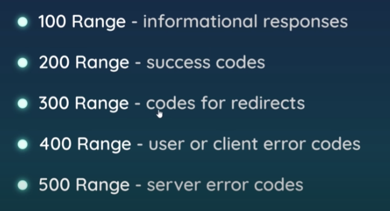

# note
## localhost
* localhost is like a domain name on the web addressing loopback
* localhost -> 127.0.0.1 -> own computer

## port number
* port number are like 'doors' into a computer
* all services (Skype, Discord, Outlook, etc.) have their own port number

## status codes
* describe the type of response sent to the browser
    * 200 - OK
    * 301 - Resource moved
    * 404 - Not Found
    * 500 - Internal Server Error
 
